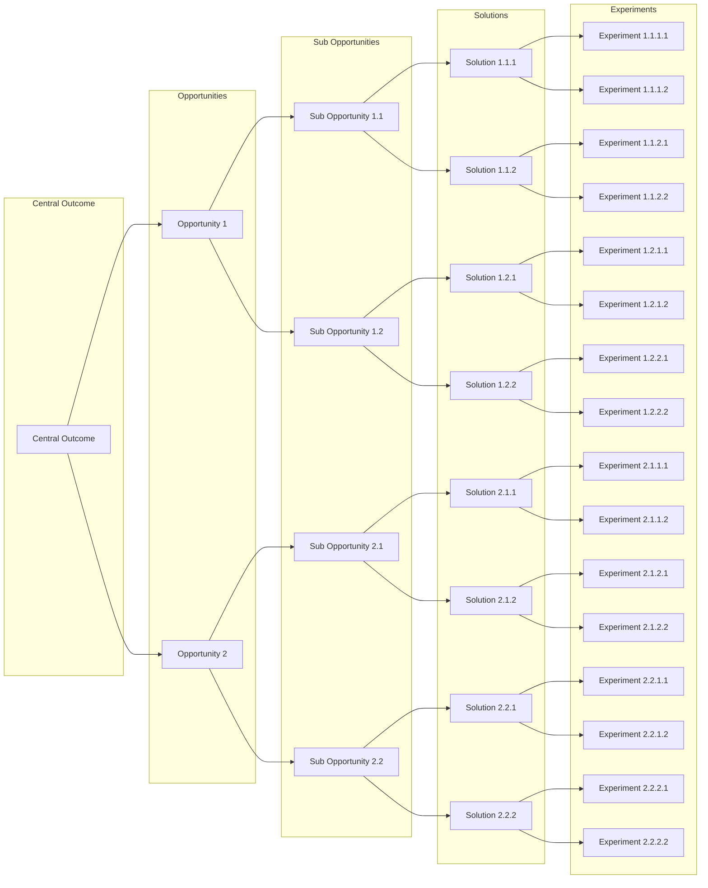

```mermaid
graph LR

subgraph Central Outcome
A[Central Outcome]
end

subgraph Opportunities
B[Opportunity 1]
C[Opportunity 2]
A-->B
A-->C
end

subgraph Sub Opportunities
D[Sub Opportunity 1.1]
E[Sub Opportunity 1.2]
B-->D
B-->E

F[Sub Opportunity 2.1]
G[Sub Opportunity 2.2]
C-->F
C-->G
end

subgraph Solutions
H[Solution 1.1.1]
I[Solution 1.1.2]
D-->H
D-->I

J[Solution 1.2.1]
K[Solution 1.2.2]
E-->J
E-->K

L[Solution 2.1.1]
M[Solution 2.1.2]
F-->L
F-->M

N[Solution 2.2.1]
O[Solution 2.2.2]
G-->N
G-->O
end

subgraph Experiments
P[Experiment 1.1.1.1]
Q[Experiment 1.1.1.2]
H-->P
H-->Q

R[Experiment 1.1.2.1]
S[Experiment 1.1.2.2]
I-->R
I-->S

T[Experiment 1.2.1.1]
U[Experiment 1.2.1.2]
J-->T
J-->U

V[Experiment 1.2.2.1]
W[Experiment 1.2.2.2]
K-->V
K-->W

X[Experiment 2.1.1.1]
Y[Experiment 2.1.1.2]
L-->X
L-->Y

Z[Experiment 2.1.2.1]
AA[Experiment 2.1.2.2]
M-->Z
M-->AA

AB[Experiment 2.2.1.1]
AC[Experiment 2.2.1.2]
N-->AB
N-->AC

AD[Experiment 2.2.2.1]
AE[Experiment 2.2.2.2]
O-->AD
O-->AE
end
```
