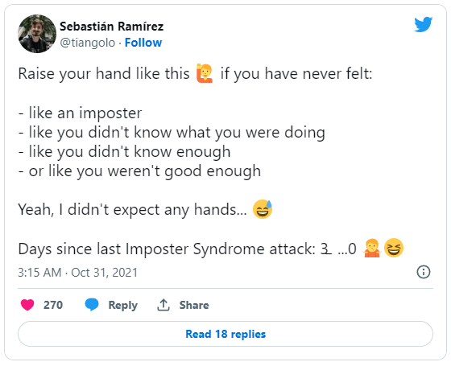

  

    <em>Grid is a <b>positioning</b> framework and <b>generative</b> app for digital  <b>product development</b></em>

---

**Documentation**: <a href="https://grid.sarantium.dev" target="_blank">https://grid.sarantium.dev</a>

**Source**: <a href="https://github.com/sarantium/grid" target="_blank">https://github.com/sarantium/grid</a>

**App**: <a href="https://gridpm.streamlit.app" target="_blank">https://gridpm.streamlit.app</a>

---

**Grid** uses **X, Y** coordinates to locate, connect and generate activities and artifacts in the product development process.

It is designed to increase individual certainty and improve group collaboration by providing a precise, shared language for speaking about the end-to-end product development lifecycle.

It is also designed to increase individual creativity and creation speed by providing a machine learning interface to draft a wide variety of product explanations and artifacts.

Grid's key features are:

- **Simple**: The entire product development process is displayed on a single page
- **Consistent**: Standardised vocabulary for describing different stages and activities
- **Intuitive**: Cell coordinates make navigation and referencing a breeze
- **Curated**: Modern product tools and templates selected with a bias for lean workflows
- **Extensible**: Add, remove or modify rows, columns and cells to get the right fit
- **Creative**: Cutting edge use of natural language processing to generate product artifacts

## :material-map-marker-plus-outline: Positioning

Positioning increases confidence in the stories that product managers tell themselves and others about the sequence and value of product activity.

Even expert product managers and engineers experience impostor syndrome. Positioning helps individuals and teams battle this uncertainty by:

- [x] locating current activity
- [x] tracing past routes
- [x] planning future routes
- [x] sharing journeys

!!! tip

    **Positioning** helps create **convincing** and **connected** explanations about **product development practice**

## :material-play-box-outline: Getting started

The easiest way to get started is by reading the [framework](table.md) and then trying out the [app](https://gridpm.streamlit.app). Also check out the [syntax](syntax.md), [reading list](reading-list.md) and the [release notes](release-notes.md).

A detailed 🚧[usage guide](usage.md)🚧 and 🚧[artificial intelligence primer](artificial_intelligence.md)🚧 are in development. Developers or advanced users can explore the documentation and app [source](https://github.com/sarantium/grid) .
