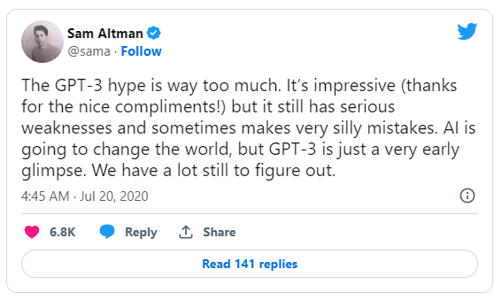

  

    <em>Grid is a <b>positioning framework</b> and <b>generating app</b> for <b>digital product development</b></em>

---

:material-file-document-arrow-right-outline: **Documentation**: <a href="https://grid.sarantium.dev" target="_blank">https://grid.sarantium.dev</a>

:material-code-tags: **Source**: <a href="https://github.com/sarantium/grid" target="_blank">https://github.com/sarantium/grid</a>

:material-robot-outline: **App**: <a href="https://gridpm.streamlit.app" target="_blank">https://gridpm.streamlit.app</a>

---

**_Positioning_** is a [framework](framework.md) that increases individual certainty and improves group collaboration by providing a precise, shared language for speaking about and connecting activities in the end-to-end product development lifecycle.

**_Generating_** is an [app](https://gridpm.streamlit.app) that increases individual creativity and introduces unpredictability by providing a machine learning interface to explore and draft a wide variety of product artifacts.

## :material-key-alert-outline: Key Features

Grid's key features are:

- **Simple**: The entire product development process is displayed on a single page
- **Consistent**: Standardised vocabulary for describing different stages and activities
- **Intuitive**: Cell coordinates make navigation and referencing a breeze
- **Curated**: Modern product tools and templates selected with a bias for lean workflows
- **Extensible**: Add, remove or modify rows, columns and cells to get the right fit
- **Creative**: Generate better product artifacts in seconds

## :material-map-marker-plus-outline: Positioning

Positioning increases confidence in the stories that product managers tell themselves and others about the sequence and value of product activity.

Even expert product managers and engineers experience impostor syndrome. Positioning helps individuals and teams battle this uncertainty by:

- [x] locating current activity
- [x] tracing past routes
- [x] planning future routes

!!! tip

    **Positioning** helps create **convincing** and **connected** explanations about **product development practice**

## :material-robot-outline: Generating

Generating increases the diversity and velocity of drafting and improving artifacts at every stage and phase of the product development lifecycle.

Combining large language model computation and specialist product prompts in an accessible interface, it encourages exploration and iteration by:

- [x] explaining ideas
- [x] answering questions
- [x] creating and improving artifacts

!!! tip

    **Generating** helps create **more** and **more diverse** product artifacts **faster**

## :material-play-box-outline: Getting started

The easiest way to get started is by trying out the [app](https://gridpm.streamlit.app) then reading the [framework](framework.md). Also check out the [reading list](reading-list.md) and the [release notes](release-notes.md). Developers or advanced users can explore the documentation and app [source](https://github.com/sarantium/grid) .

[Try the App](https://gridpm.streamlit.app){ .md-button .md-button--primary} [Read the Framework](framework.md){ .md-button .md-button--primary} [Explore the Source](https://github.com/sarantium/grid){ .md-button .md-button--primary }
