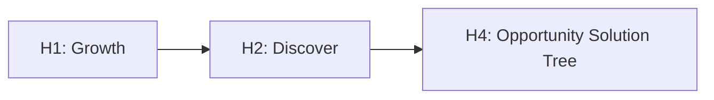
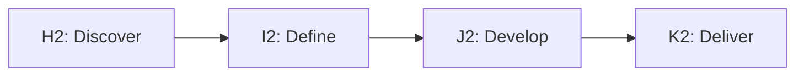
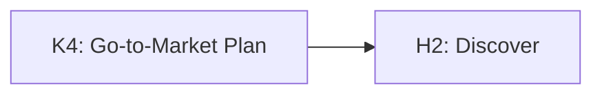
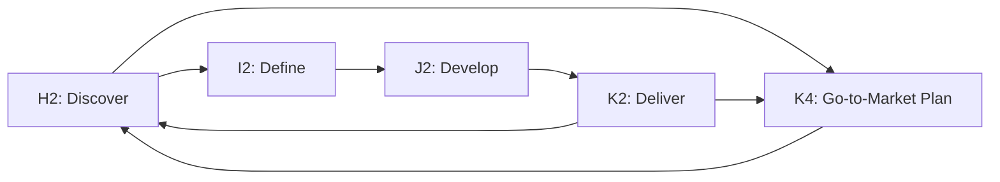

Photo by <a href="https://unsplash.com/@sharonmccutcheon?utm_source=unsplash&utm_medium=referral&utm_content=creditCopyText">Alexander Grey</a> on <a href="https://unsplash.com/photos/_Y3IuVbPpmU?utm_source=unsplash&utm_medium=referral&utm_content=creditCopyText">Unsplash</a>

Like a chessboard or spreadsheet, **Grid** has a simple cartesian coordinate referencing system:

- [x] **X** coordinates are alphabetical and identify columns
- [x] **Y** coordinates are numerical and identify rows
- [x] **X**, **Y** coordinates combine an alphabet and a number to identify a cell
- [x] **X1Y1 : X2Y2** shorthand to reference multiple cells

## Slices

A **slice** is a subsection of the **Grid** framework used to describe or discuss specific **routes**. Slices are abbreviated tables with only relevant rows, columns and cells included. The slice below - **H1:K4** - excludes **row 3**.

| :material-map-marker-plus-outline: |             H             |       I       |         J          |         K         |
| :--------------------------------: | :-----------------------: | :-----------: | :----------------: | :---------------: |
|               **1**                |        **Growth**         |  **Growth**   |     **Growth**     |    **Growth**     |
|               **2**                |         Discover          |    Define     |      Develop       |      Deliver      |
|               **4**                | Opportunity Solution Tree | Product Brief | Production Release | Go-to-Market Plan |

## Routes

A **route** is a movement within a **slice** that connects cells in order to explain product activity. Like directions in 📍 Google Maps 📍, routes help contextually locate activity in a narrative path.

### Moving down columns

Moving down a column generally increases the specificity of the activity description. As we move from **H1** to **H4**, we shift from the product development **stage** to the **phase** to the key **outcome**.

### Moving across rows

Moving across a row generally progresses the activity timeline. As we move from **H2** to **K2**, there is progression through the classic double diamond cycle in product development.

### Moving orthogonally

More often than not, connecting cells skips rows and columns in between. Reversed movement - in which time sequences are reversed - is also common in product development. Orthogonal movement refers here to traversing a slice in some combination of skipping and reversal.

:fontawesome-brands-amazon: **Amazon's** :fontawesome-brands-amazon: strategy of writing press releases in the go-to-market plan (**K4**) before commencing discovery (**H2**) is a good illustration of orthogonal movement.

This route **reverses** the normal sequence of activities **and** it traverses the abstraction hierarchy via skipping by moving from a specific **outcome** to a more general activity **phase**.

### Simultaneous movement

Activity can move simultaneously in multiple routes. And some routes repeat themselves iteratively in cycles

A busy product manager could easily be juggling a variety of simultaneous and iterative activity.

!!! tip

    Routes use **coordinate references** to connect cells by moving **down columns**, **across rows** and **orthogonally**. Routes can be **linear**, **reversed**, **simultaneous**, or **iterative**.

## Cell ideographs

In communication theory, an [ideograph](https://https://sites.dwrl.utexas.edu/davis/courses/rhe-321/rhe-321-schedule/ideographs/) is an ordinary word or phrase used as a linguistic shortcut to convey a host of contested ideas embedded in a cultural discourse.

These words or phrases are information dense concepts that compress context, meaning and argument into a single term.

It is helpful to think of each cell as housing **product development ideographs** that form the basis of **slices** and **routes**.

## Row names

In addition to numerical referencing, each row also has a hidden name property that is optionally used in verbal descriptions of slices and routes.

|  Row   | Name          | Description                                       |
| :----: | :------------ | :------------------------------------------------ |
| **1**  | Stage         | Highest abstraction activity sequence             |
| **2**  | Phase         | High abstraction activity sequence within a stage |
| **3**  | Icon          | Visual representation of the phase                |
| **4**  | Outcome       | Primary output                                    |
| **5**  | Documentation | Tools, techniques and templates                   |
| **6**  | Metric        | Measures of success                               |
| **7**  | Ceremony      | Organisational rituals                            |
| **8**  | Question      | Key questions to guide thinking                   |
| **9**  | Team\*        | Collaborators, roles and resoponsibilities        |
| **10** | Mindset\*     | Individual strengths                              |
| **11** | Cocreation\*  | User involvement                                  |

\* under evaluation for inclusion in framework
